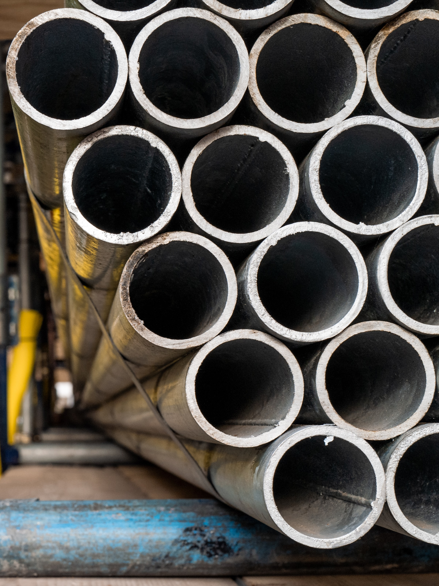

# Some text

## Some other text

An unknown number of the stone-carved statues have been affected by the blaze, Chile's cultural heritage undersecretary said.
Easter Island has nearly 1,000 of the megaliths, known as moai. They have oversized heads and generally stand about 4m (13ft) high.
They were carved by a Polynesian tribe more than 500 years ago.

Lorem ipsum dolor sit amet consectetur adipisicing elit. Laboriosam dolor commodi distinctio.
Est, dignissimos facilis temporibus quis quod laboriosam impedit maxime iste quisquam eum rerum repudiandae delectus quo eaque esse ab labore.
Possimus doloribus quae pariatur minima animi, magni non, eos quod error culpa dignissimos eveniet libero reprehenderit veritatis dolorem laudantium quos esse ea.
Nulla consectetur corrupti necessitatibus ad tempore dicta, accusamus distinctio nemo repudiandae quidem nam vel quisquam animi perferendis delectus quis odio id consequatur sint tenetur eos doloremque placeat vitae! Autem quas est non earum deserunt officiis voluptatem odio hic quo fuga. Labore maiores id voluptas architecto, minus nam velit nisi aut dolores rem deserunt aliquid modi, nihil tenetur debitis distinctio? Nihil dolore iusto vero earum nisi assumenda consequatur sequi recusandae maxime odit, illum dolorum reiciendis magnam id asperiores dolores deleniti adipisci possimus ab, minus commodi? Illo dolore tempora quisquam nobis fuga eaque officiis quasi repellendus alias mollitia excepturi sequi omnis, ea debitis dignissimos dicta facere vel delectus ratione voluptatem voluptatum iure ab repellat unde. Sit, ut in molestias laudantium alias mollitia error praesentium excepturi voluptatem, nisi delectus amet accusantium illum expedita dolorem cumque explicabo. Labore, dolore reprehenderit.
