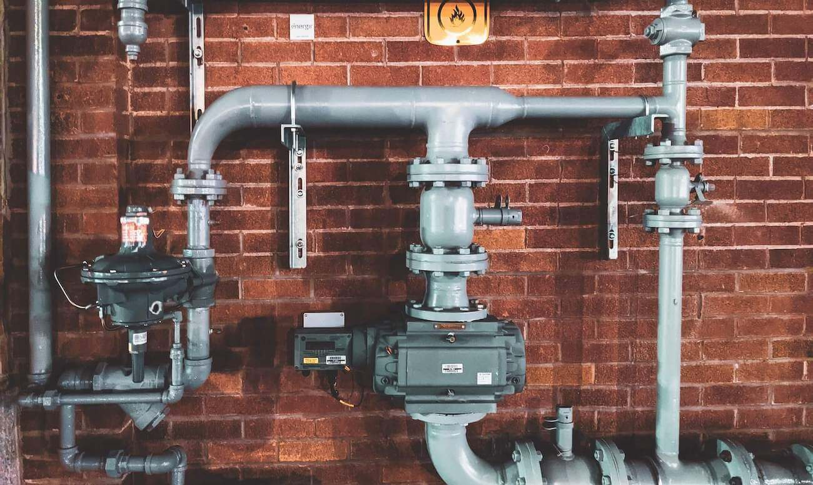
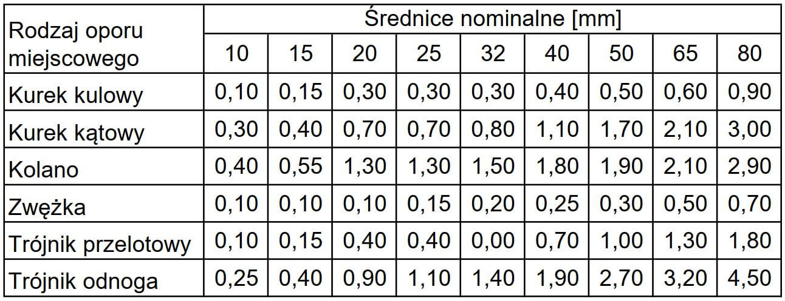

import { Box, Divider, Typography } from '@mui/material'

Małe instalacje z jednym urządzeniem gazowym, np domki jednorodzinne z kondensacyjnym kotłem gazowym nie sprawiają trudności. Najczęściej wystarczy przewód stalowych DN15. W przypadku większych instalacji, z większą liczbą odbiorników gazu, z pomocą przyjdzie nam [kalkulator](../gaz) doboru średnic.

  

#### Dostępne ciśnienie

Przy obliczeniach instalacji gazowych najważniejszy warunek to zapewnienie optymalnego ciśnienia gazu na odbiorniku (zazwyczaj na tym najniekorzystniej położonym w stosunku do źródła gazu). Pamiętając przy tym, że na początku instalacji, najczęściej za reduktorem, mamy określone ciśnienie dyspozycyjne. Naszą rolą jest dobór odpowiedniej średnicy tak, aby urządzenie spalające gaz mogło pracować prawidłowo.

Ważnym zjawiskiem jest wzrost ciśnienia gazu ziemnego w odcinku pionowym, przy wznoszeniu o 1,0 m wynosi 5,4 Pa. Oznacza to, że trzeba uwzględnić ten wzrost przy obliczeniach całkowitego spadku ciśnienia poprzez odjęcie tej wartości od całkowitych strat ciśnienia w rozpatrywanym odcinku.

#### Standardowa instalacja niskociśnieniowa

Nasza instalacja w małej hali składa się z 3 nagrzewnic gazowych o mocy 15kW każda.
Z gazowni zazwyczaj posiadamy warunki przyłączenia, z których wyczytujemy że ciśnienie za reduktorem dla naszej instalacji to 2.5kPa. Z karty technicznej nagrzewnic, odczytujemy, że maksymalne ciśnienie gazu dla tych urządzeń to 5 kPa (50 mbar), a minimalne to 2kPa (20 mbar). Stąd wiemy, że spadek ciśnienia w instalacji nie może przekroczyć 0.5kPa (500 Pa), jednakże straty w instalacji gazowej nie powinny przekraczać 150-200Pa.

<Box sx={{ maxWidth: '500px', mx: 'auto', my: 3 }}>
  
</Box>

#### Dobór średnic

Instalacja gazowa od reduktora do pierwszego rozdziału powinna dostarczać w sumie 45 kW, za pierwszym rozdziałem 30 kW i ostatni odcinek do odbiornika to 15 kW. Długości odcinków pokazano na poprzednim rysunku. Zajrzyjmy do [kalkulatora](../gaz) i wpiszmy odpowiednie wartości. Dla poszczególnych odcinków program dobrał następujące średnice rur:.
15kW - DN15 - 4,95 Pa/m
30kW - DN20 - 5,41 Pa/m (wybrano większą średnice)
45kW - DN25 - 3,41 Pa/m (wybrano większą średnice)
Załóżmy, że każdy poziomy odcinek instalacji to 10m, a piony to 4m.
Stąd całkowita strata ciśnienia liniowa wyniesie:
dP = 4,95 _ 10 + 5,41 _ 10 + 3,41 _ 14 = 151,3 Pa
Mając dobrane wymiary i obliczoną liniową stratę ciśnienia na metr bieżący przewodu, powinniśmy uwzględnić jeszcze miejscowe straty ciśnienia. Możemy to zrobić poprzez dodanie dodatkowej długości zastępczej przewodów z uwagi na straty miejscowe korzystając z poniższej tabeli. Na potrzeby naszego przykładu jednak założymy w uproszczeniu, że straty miejscowe wyniosą 20% strat liniowych.
Przy uwzględnieniu oporów liniowych wynoszących 151,3 Pa oraz miejscowych 0,2 _ 151,3 = 30,3 Pa oraz odejmując wzrost ciśnienia gazu w cztero metrowym pionowym odcinku 4 x 5,4 = 21,6 Pa. Otrzymujemy całkowity spadek ciśnienia w wysokości
151,3 + 30,3 - 21,6 = 160 Pa
Dobrane średnice rur spełniają założenia tj. całkowity spadek ciśnienia na najbardziej niekorzystnym odcinku jest mniejszy niż 200 Pa.

  
 _Tabela 1 Długości zastępcze_

#### Podsumowanie

Dobór średnic z wykorzystaniem kalkulatora w instalacjach gazowych jest bardzo proste. Jeśli znamy minimalne wymagane przez odbiornik ciśnienie oraz dostępne ciśnienie na wyjściu z reduktora, wystarczy wprowadzić odpowiedni przepływ w danych odcinkach i odczytać spadek ciśnienia. Prędkość przepływu na najbardziej obciążonym odcinku nie powinna przekraczać 6 m/s (K. Bąkowski, “Sieci i instalacje gazowe”).
