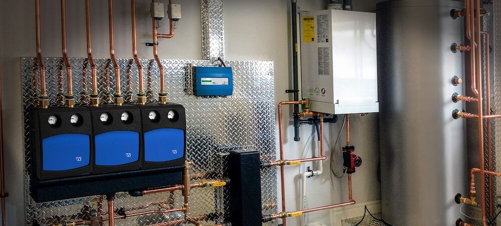
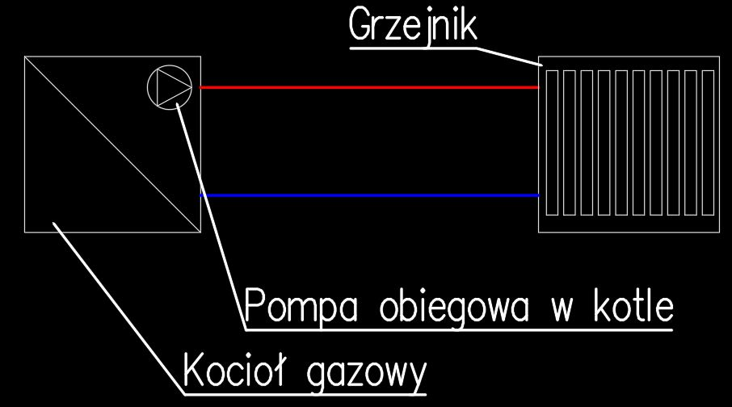
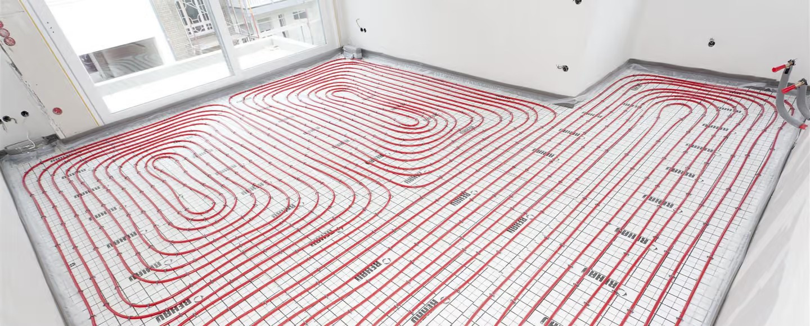

import { Box, Divider, Typography } from '@mui/material'

Ten artykuł poświęcony jest bardziej instalatorom czy innym osobom związanym z branżą, nie mającym styczności
z obliczeniami instalacji grzewczych, a chcieliby szybko dobrać odpowiednie średnice przewodów grzewczych,
korzystając z zamieszczonego na stronie [kalkulatora](../ogrzewanie).

<Box sx={{ mx: 'auto', my: 3 }}>
  
</Box>

#### Opory przepływu

Woda (lub inny czynnik grzewczy) w instalacji musi pokonać opory tarcia związane z chropowatością przewodów. Opory te zwane są liniowymi. Oprócz tego w instalacjach występują opory miejscowe w:

- kolanach
- trójnikach
- zaworach
- redukcjach / rozszerzeniach
- opory urządzeń (np. grzejniki)

#### Tok obliczeń

Załóżmy najprostszy układ grzewczy (przedstawiony na rysunku poniżej) składający się z:

- źródła ciepła (np. kocioł gazowy z wbudowaną pompą obiegową)
- przewody zasilające i powrotne
- odbiornik ciepła (np. grzejnik)

<Box sx={{ maxWidth: '500px', mx: 'auto', my: 3 }}>
  
</Box>

Co trzeba tutaj obliczyć? Musimy skalkulować jaki będzie spadek ciśnienia (opory) w naszej instalacji na odcinku od źródła ciepła do odbiornika. Potrzebne nam to będzie, żeby ostatecznie dobrać odpowiednią pompę obiegową. Ale na początku musimy zająć się obliczeniem odpowiednich średnic rur i dzięki temu obliczyć spadki ciśnienia. Przyjdzie nam w tym z pomocą [kalkulator](../ogrzewanie). Poniżej przedstawiam punkt po punkcie co należy wykonać:

##### 1. Ustalić wymaganą moc grzewczą odbiornika

W naszym przypadku niech będzie to 10kW. Jest to zbyt duża moc jak na pojedynczy standardowy grzejnik, jednakże dla naszego przypadku niech będzie specjalnie taka duża, żeby przepływ nie wyszedł za mały.

Tutaj ważna informacja. Dla naszych obliczeń istotne jest zapotrzebowanie na moc odbiornika, a nie nominalna moc źródła ciepła.
Spójrzmy na taki przypadek. Dom jednorodzinny, dla którego obliczono obciążenie cieplne na poziomie 8kW. Dla domu założono kocioł gazowy dwufunkcyjny o mocy 24kW. To, że mamy kocioł o takiej mocy, nie znaczy, że tyle ciepła będziemy produkować. Dobór średnic na moc 24kW na potrzeby ogrzewania byłby zbytnim przewymiarowaniem, ponieważ dom potrzebuje w największe mrozy moc grzewczą na poziomie 8kW i dla takiej mocy dobieramy średnice przewodów.

##### 2. Założyć odpowiednią różnicę temperatur w instalacji i policzyć przepływ

Różnica temperatur między powrotem a zasilaniem, razem z wymaganą mocą wpływa na przepływ w instalacji zgodnie ze wzorem. (Nie przerażać się proszę wzorem, [kalkulator](../ogrzewanie) sam policzy przepływ bez problemu)

Q = P \ ((Tz - Tp) \* cp)

Gdzie: Q - przepływ [kg/s] - dla wody wychodzi [dm3/s], P - moc [kW], Tz - temperatura zasilania [°C], Tp - temperatura powrotu [°C], cp - ciepło właściwe - dla wody 4.2 [kJ/ kg * K]

Różnicę temperatur dla ogrzewania grzejnikowego zakłada się na poziomie 20° lub 15°, dla ogrzewania
podłogowego około 7°.

##### 3. Znając przepływ, dobrać średnice rur

Ogólna zasada doboru średnic rur jest prosta. Chcemy mieć w instalacji jak najmniejsze średnice (bo tak jest najtaniej i stosunkowo najłatwiej w montażu), dla których spadek ciśnienia jest na akceptowalnym poziomie.
W naszym kalkulatorze są odpowiednio zapisane akceptowalne spadki ciśnień, więc nie trzeba się tym przejmować, jeśli nie jesteś projektantem i nie masz doświadczenia.

Wzory na obliczanie współczynnika tarcia rur i liniowy opory są zbyt skomplikowane i nie będę ich tutaj przytaczał. Standardowo projektanci instalacji korzystają z kalkulatorów lub nomogramów do wyznaczania liniowego spadku ciśnienia.

Dlatego ten punkt rozwiążemy stosując [kalkulator](../ogrzewanie). Wejdź w link i wpisz 10 jako moc i różnicę temperatur jako 20°. Temperaturę czynnika pozostaw jako 80°.
Możesz też zmienić rodzaj rur na PEX i zobacz, że program proponuje średnicę 25x2.5, oraz że automatycznie obliczył przepływ w [m3/h] oraz [dm3/s].

Ciekawostka - temperatura wody w instalacji ma wpływ na opory. Im woda zimniejsza tym liniowa strata ciśnienia w przewodzie jest większa.

##### 4. Przykład doboru

<Box sx={{ mx: 'auto', my: 3 }}></Box>

Częsty przypadek prostych obliczeń to dobór przewodów doprowadzających czynnik grzewczy od kotła do rozdzielaczy ogrzewania podłogowego. Załóżmy, że mamy 2 kondygnacyjny budynek mieszkalny jednorodzinny i wymagana moc grzewcza dla parteru wynosi 3 kW, dla poddasza 4 kW, razem dla domu 7 kW. Jako, że jest to ogrzewanie podłogowe przyjmijmy różnicę temperatur na poziomie 7°.

W programie najpierw policzymy jaką średnicę rur Pex powinniśmy wybrać dla wspólnego przewodu czyli dla 7kW - i jest to 32x3.0 i odpowiednio dla przewodów na poszczególne rozdzielacze: zarówno dla 3 kW i 4kW będzie to 25x2.5.

<Box sx={{ mx: 'auto', my: 2 }}>[Powrót do listy artykułów](./)</Box>
