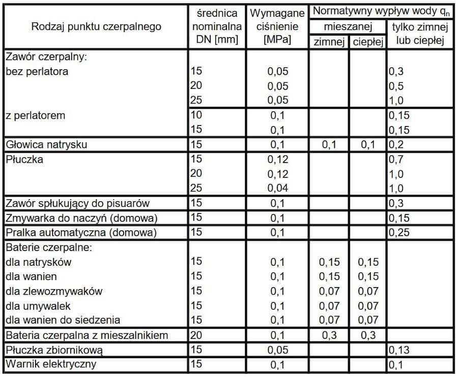

import {
  Paper,
  Table,
  TableBody,
  TableCell,
  TableContainer,
  TableHead,
  TableRow,
  Box,
  Divider,
  Typography,
} from '@mui/material'

Dobór średnic instalacji wodociągowej nie jest skomplikowany. Polega na sprawdzeniu ile i jakie przybory będzie obsługiwał dany odcinek przewodu. Na tej podstawie oblicza się przepływ i następnie dobiera średnice na podstawie kryterium prędkości.

  

#### Przybory sanitarne

W normie PN-92/B-01706 “Instalacje wodociągowe -- Wymagania w projektowaniu” przedstawiono normatywne wypływy z punktów czerpalnych. Dla każdego odcinka należy zsumować sumę wypływów normatywnych tzw. Σqn. Z tej wartości następnie ustala się przepływ obliczeniowy.
Dla przykładu ostatni odcinek pionu zasilający mieszkanie na najwyższej kondygnacji dostarcza wodę do następujących przyborów.

- płuczka zbiornikowa 0,13
- umywalka 0,07
- zlewozmywak 0,07
- pralka 0,25
- natrysk 0,15

Suma qn dla tego mieszkania wyniesie Σqn = 0,67 dm3/s

  
 _Tabela 1 - Wypływy normatywne_

#### Przepływ obliczeniowy

Mając ustaloną sumę qn, możemy od razu przejść do wyznaczenia przepływu obliczeniowego. Zgodnie z normą PN-92/B-01706 mamy do dyspozycji szereg wzorów zależnych od rodzaju budynków oraz od sumy qn. Dla powyższego wyliczenia Σqn = 0,67 dm3/s na potrzeby budynku mieszkalnego przepływ obliczeniowy wynosi 0,43 dm3/s.

  
 _Tabela 2 - Przeplywy obliczeniowe_

#### Dobór średnic.

Na potrzeby doboru średnicy danego odcinka należy ustalić prędkość przepływu w oparciu o obliczony wcześniej przepływ. Odpowiednio dobrana średnica przewodu zapewnia przepływ nie większy niż podano w tabeli poniżej. Dla powyższych obliczeń kalkulator dobrał średnice rur Pex 25x2,5 w oparciu o kryterium prędkości < 1,5 m/s

<TableContainer component={Paper} sx={{ width: 'calc(90vw - 22px)', maxWidth: '100%' }}>
  <Table sx={{ minWidth: '400px', width: '100%', overflowX: 'auto' }}>
    <TableHead>
      <TableRow>
        <TableCell component="th" scope="row">
          Rodzaj przewodu
        </TableCell>
        <TableCell component="th" scope="row" align="right">
          PN-92/B-01706 [m/s]
        </TableCell>
        <TableCell component="th" scope="row" align="right">
          DIN 1988 [m/s]
        </TableCell>
      </TableRow>
    </TableHead>
    <TableBody>
      <TableRow sx={{ '&:last-child td, &:last-child th': { border: 0 } }}>
        <TableCell component="th" scope="row">
          Połączenia od pionu do punktów czerp.
        </TableCell>
        <TableCell align="right">1,5</TableCell>
        <TableCell align="right">2,0</TableCell>
      </TableRow>
      <TableRow sx={{ '&:last-child td, &:last-child th': { border: 0 } }}>
        <TableCell component="th" scope="row">
          Piony w instalacjach wodociągowych
        </TableCell>
        <TableCell align="right">1,5</TableCell>
        <TableCell align="right">2,0</TableCell>
      </TableRow>
      <TableRow sx={{ '&:last-child td, &:last-child th': { border: 0 } }}>
        <TableCell component="th" scope="row">
          Przewody rozdzielcze
        </TableCell>
        <TableCell align="right">1,0</TableCell>
        <TableCell align="right">1,5</TableCell>
      </TableRow>
      <TableRow sx={{ '&:last-child td, &:last-child th': { border: 0 } }}>
        <TableCell component="th" scope="row">
          Połączenia wodociągowe
        </TableCell>
        <TableCell align="right">1,0</TableCell>
        <TableCell align="right">1,5</TableCell>
      </TableRow>
    </TableBody>
  </Table>
</TableContainer>

_Tabela 3 - Kryteria prędkości_

#### Obliczenia automatyczne

W celu liczenia rozległych instalacji pomocne są kalkulatory automatycznie dobierające średnice rur w zależności od ilości przyborów sanitarnych. Aplikacja pod tym linkiem pozwala dobierać średnice przewodów wodociągowych. Wystarczy wpisać ilość przyborów zasilanych przez dany odcinek. Ponadto możliwe jest kopiowanie obliczeń i dodawanie kolejnych przyborów.
